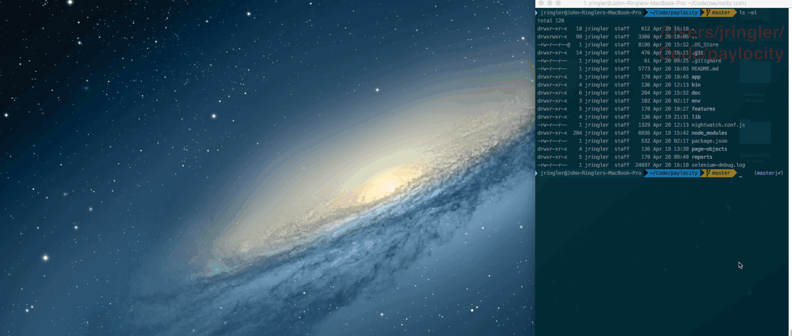

##  Paylocity QA Challenge

This guide describes the custom framework that was built in order to automate some of test scenarios featured in the QA Challenge document and explains how to set it up in order to run the tests on a local machine and visualize the results.

### Table of contents

* [Description of Framework](#description-of-framework)
* [Technology Stack](#technology-stack)
* [Tests Organization](#tests-organization)
* [Installation and Setup](#installation-and-setup)
* [Run Tests](#run-tests)
* [Known Bugs](#known-bugs)

### Description of Framework

* As the test cases in the Challenge document are essentially written as Acceptance Tests, the framework that was chosen to automate these tests is Cucumber, a popular testing framework that supports Behavior Driven Development (BDD) which is ideal to create automation of acceptance tests. It offers a way to write tests that anybody can understand, regardless of their technical knowledge.

* With Cucumber tests are organized within ```.feature``` files. Those files contain executable specifications written in a language called Gherkin. Gherkin is plain-text English that has enough structure (in the form of keywords) which allows for concise description of examples in order to illustrate business rules in most real-world domains.

* This project uses Cucumber.js, the JavaScript implementation of Cucumber which runs on Node.js (4 and above) and supports modern web browsers such as Google Chrome and Mozilla Firefox.

* In order to run the tests in a browser, an instance of *Selenium Standalone Server* needs to run locally.

* The tests are written using Nightwatch.js,an automated testing framework for web applications and written in Node.js. It uses the WebdDriver API.


### Technology Stack

- [NodeJS](https://nodejs.org)
- [NightwatchJS](http://nightwatchjs.org/) (Wrapper over Selenium API)
- [NightwatchJS custom assertions](http://nightwatchjs.org/api#assertions) (Asserion library)
- [nightwatch-cucumber](https://github.com/mucsi96/nightwatch-cucumber) (Cucumber.js plugin for NightwatchJS)
- [selenium-server](https://www.npmjs.com/package/selenium-server) (Node wrapper for Selenium)


### Tests Organization

*  ###### Feature Files
A .feature file is supposed to describe a single feature of the system, or a particular aspect of a feature. It's just a way to provide a high-level description of a software feature, and to group related scenarios.
A feature has two basic elements -- a header and one or more scenarios.

1. *Header*: A header has three basic elements -- the Feature: keyword, a name (on the same line) and a description spans multiple lines.
2. *Scenario*: A scenario is a concrete example that illustrates a business rule. It consists of a list of steps.
Scenarios logically flow as a series of steps: **Given --> When --> Then**.

* ###### Step-definitions
A step-definition is a small piece of code with a pattern (this framework uses RegEx) attached to it. The pattern is used to link the step definition to all the matching steps, and the code is what Cucumber will execute when it sees a Gherkin step.

* ###### Page-Objects and Element Mappings
The traditional manner in which elements on a page are accessed is through a Page-object that contains all the elements on any given page. In other words, all the elements that are needed for the tests to interract with the page are stored in a Page-Object and using different locator strategies (by name, id, class, xPath etc...).

* ###### Hooks
Nightwatch provides the standard *BeforeFeatures/AfterFeatures* and *BeforeScenario/AfterScneario* hooks to be used in the tests.

### Installation and Setup

* ###### Requirements:
The automation test suite can be executed with a simple command line tool using [npm](https://www.npmjs.com/). NodeJS is pre-required (Node comes with npm installed) and Java JDK must be installed.
Note: Selenium Standalone Server and chromeDriver are in the repository so they do not need to be installed separately.

* ###### Installation:
Open a terminal and type:

```git clone https://github.com/jringler/paylocity-challenge.git```

From the **./paylocity-challenge** folder, install the dependencies by typing:

```npm install```

* ###### Setup:
Edit the ./env/test.env file and make sure the following environment variables have been set as follow:
```javascript
export URL="./app/login.html"
export USERNAME="testUser"
export PASSWORD="Test1234"
```

The entire nightwatch configuation is set in the ***./nightwatch.conf.js*** file. There should not be a need to modidy this file but ensure that the path to **selenium-server-standalone.jar** and **chromedriver** are correct.

### Run Tests

Different environment variables can be entered in a new .env file in the ***./env/*** folder.
To use the default ***./env/test.env*** file, the tests can be executed by simply typing the following command in the terminal:
```npm run test```

The tests will run against Google Chrome with the window size that is set in the  **./nightwatch.conf.js** file.

After all the tests are completed, an HTML report [cucumber-html-reporter](https://www.npmjs.com/package/cucumber-html-reporter) will open in a new tab showing the details of the test run. The **./reports/** folder will contain a JSON file and the resulting HTML document that serve as the report. Screenshots of the browser during the test execution can also be found under the **./reports/screenshots/** folder.

###### Execution Preview:


###### Sample CucumberJS Report:


### Known Bugs

A list of defects found while testing the application can be found in the following document:

[BUGREPORT.md](doc/BUGREPORT.md)
